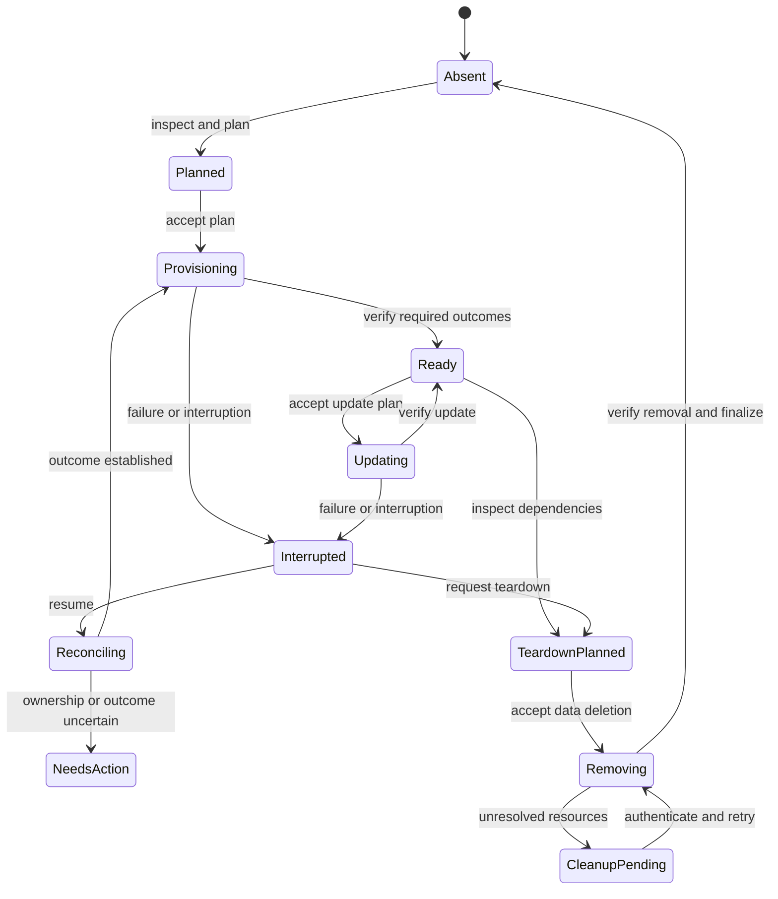

# Reliable, reversible provisioning tools

**Recommendation:** Keep one user-facing command for the full deployment lifecycle.
Use a small POSIX-shell launcher to obtain a versioned CLI. Put resource ownership,
API operations, recovery, and terminal rendering in a compiled Go application. Keep
Docker Compose as the workload description. Add a PowerShell launcher only when
native Windows support becomes worthwhile.

This is an engineering recommendation for the requirements in this report. It is
not a claim that shell cannot implement them. Bash remains a reasonable transition
implementation, but a multi-provider resource journal and a rich terminal interface
make its maintenance cost substantial.

The central requirement is an explicit cleanup contract. Before each change, the
tool must know what it owns, how to undo that change, and how to recover an uncertain
result. A polished interface must expose that information through readable plans,
accurate progress, and useful recovery instructions.

## 1. Scope and evidence

This report covers the Guacamole deployment in this repository and similar tools
that change both a host and external services. The intended reader is an engineer
responsible for implementation and maintenance.

The evidence snapshot is 11 September 2026. The local source baseline is commit
`42a54fa` plus the existing workspace changes. Observations about this project refer
to that workspace, not an immutable release. No deployment or account changes were
performed. Local experiments used small, isolated shell examples.

Three evidence categories appear throughout:

- **Documented:** behavior described by the cited standard, vendor, or maintainer.
- **Observed:** behavior in the local source or the isolated shell experiments.
- **Proposed:** a design, support target, estimate, or acceptance criterion requiring
  implementation and testing.

Source versions matter. The shell reference includes POSIX.1-2024. The Guacamole
documentation examined identifies version 1.6.0. The current TUF specification
identifies version 1.0.36, dated 5 August 2026. Rolling vendor documentation and
repository `main` branches can change. Pin implementation dependencies and source
revisions during the release design; this report does not invent a tested version
combination.[^2][^18][^45]

### Current project observations

The existing source already separates some database, startup, and Cloudflare domain
logic into libraries. It generates the database schema from the selected Guacamole
image. It also waits for container health and probes the local HTTPS endpoint.
These are useful foundations.

The following observations determine the migration priorities:

| Current behavior | Consequence for the new design |
|---|---|
| Setup copies files from a checkout into `/opt/guacamole` | Package all required assets in the release. Resolve paths independently of the working directory. |
| Setup requires root before any action | Separate unprivileged discovery and cloud operations from host changes that require elevation. |
| Resources are often found by display name or hostname | Introduce deployment IDs, provider object IDs, and explicit adoption rules. |
| DNS records and application configuration can be replaced | Record the prior managed fields before modification. Detect later changes before restoration. |
| Graph errors receive broadly similar retries | Classify errors and reconcile ambiguous mutations before another create request. |
| The Access client password is passed between providers | Record its non-secret credential ID before continuing, so failed attempts can revoke it. |
| Compose has a fixed project name | Give each deployment a stable, unique project identity. |
| Teardown calls Compose and leaves the bind-mounted database | Implement teardown across local files, provider resources, and host changes. |
| The setup script writes an unencrypted nginx private key | Resolve this conflict with the project's secret-handling requirements before claiming compliance. |
| Runtime passwords and tokens enter container environment variables | An in-memory Compose override alone does not establish disk-free secret handling throughout the runtime. |

These are source observations, not findings from a live deployment. Relevant local
files are listed in the source notes.[^54]

## 2. Implementation architecture

### Comparison

| Approach | Advantages for this project | Costs and limits | Assessment |
|---|---|---|---|
| POSIX shell throughout | Small initial dependency surface; useful on minimal Unix systems | Structured state, error propagation, terminal control, and API orchestration require considerable supporting code | Use for the launcher |
| Bash with small modules | Closest migration from the current source; arrays and functions aid implementation | Requires a declared Bash baseline; native Windows needs another environment; recovery remains custom work | Viable transition |
| Bash with Gum | Adds selection, input, progress, and styling without designing each widget | Ships another binary; shell still owns recovery and failure handling | Good bounded improvement if Bash remains |
| Go CLI with shell and PowerShell launchers | Structured data, embedded assets, explicit errors, a terminal UI ecosystem, and OS-specific adapters | Requires binary releases and careful work on locking, privileges, signing, and process handling | Recommended destination |
| Rust CLI with launchers | Strong types and established installer precedents | A new implementation and release pipeline; terminal and platform libraries still need evaluation | Credible alternative if maintainers prefer Rust |
| Python application | Productive API and testing ecosystem | Must supply or require a compatible interpreter and package environment | Reasonable in a managed fleet; less attractive for this bootstrap experience |
| Ansible or Terraform behind a custom CLI | Existing provider or host-management abstractions can reduce custom work | Additional runtimes, state, and ownership semantics; deletion and secret policies still require design | Evaluate selectively, not as an automatic replacement |

Go can embed templates and configuration defaults in the binary. Its process API
accepts an executable and argument list without requiring shell evaluation. These
features reduce packaging and quoting work, but they do not make host operations
transactional.[^21][^50]

Terraform provides a useful model for binding configuration to remote object IDs and
locking state. Its sensitive-value controls need separate scrutiny: hiding a value
from output does not necessarily omit it from state. Ansible check mode also depends
on module support. Neither tool automatically supplies this project's complete
teardown contract.[^7][^8][^9][^47]

### Proposed boundaries

```text
POSIX launcher / optional PowerShell launcher
                    |
         verified, versioned guacctl binary
                    |
       command parser and deployment selection
                    |
            planner and lifecycle engine
           /              |              \
  durable state      provider adapters     event stream
  and operation      host / Compose /     /     |      \
  records            Graph / Cloudflare  rich  plain  JSON
```

Keep these boundaries small and explicit:

- The **launcher** downloads and verifies a release, then passes arguments through.
- The **planner** compares desired configuration, recorded ownership, and observed
  resources. It performs no infrastructure mutations.
- The **lifecycle engine** executes approved plans and records operation outcomes.
- Each **adapter** implements inspection, creation, modification, removal, and
  resource-specific recovery.
- The **state store** handles durability, compatibility, and exclusive execution.
- The **renderer** consumes events. It cannot decide whether an operation succeeded.

Give the user one entry point, even if the repository contains multiple modules.
For a Bash transition, the same downloaded `guacctl` script can dispatch `provision`
and `teardown`. The release archive supplies its libraries and templates.

### Installer case studies

**Determinate Nix Installer** retains an installation receipt and the installer
binary under `/nix`. It exposes planning and uninstall operations. This is a close
precedent for retaining the information and executable needed to undo installation.
It does not prove reversibility for the Graph and Cloudflare operations in this
project.[^6]

**Rustup** uses a shell bootstrap to obtain a native installer. Its source handles
terminal input separately when the script arrives on stdin. It also detects an
execution failure associated with a `noexec` temporary directory. These details
illustrate why a reliable launcher still needs dedicated tests.[^4]

**uv** offers shell and PowerShell installation paths and version-specific installer
URLs. Its uninstall guidance treats executables and other stored data separately.
The lesson is to inventory application-created data as well as the installed
program.[^5]

**Docker's convenience installer** detects platforms and installs dependencies, but
Docker recommends it for testing and development. The official documentation also
limits its support for derivatives. Reusing that script cannot establish broad
production support or complete host restoration.[^10][^11]

## 3. Distribution without a checkout

### Proposed release contract

Publish immutable releases containing the CLI, workload templates, schema metadata,
licenses, checksums, and provenance. Choose explicit OS and architecture artifacts.
Pin container image digests in a release manifest after verifying the required
platforms. A moving image tag must not silently change an existing deployment.

Keep an installed copy of the release needed for teardown. Store its version and
digest in the deployment record. Teardown must work without contacting the release
server; it will still need the external providers that own remote resources.

The launcher must finish the download and verification before running the payload.
Use a private temporary directory and bounded downloads. Handle HTTP failures,
redirects, proxies, trusted certificate overrides, and interrupted transfers.
Restrict download protocols and preserve the payload's exit status. curl documents
separate controls for these behaviors, including time limits and retry handling.[^17]

Inspect archive members before extraction. Reject absolute paths, parent traversal,
and escaping links. Extract into an owned staging directory, validate the file set,
then install the release. Do not extract an unverified archive over an existing
deployment.

An installer also needs a cleanup record for temporary downloads, private caches,
installed launchers, and abandoned staging directories. The next run can remove stale
temporary items only after proving that they belong to this tool and no active run
uses them.

### Trust and the first command

A checksum downloaded beside a binary detects corruption but cannot independently
authenticate a compromised download server. A verification key obtained from that
same compromised channel has the same problem.

Define the initial trust decision. Options include a trusted package source, a
signed native package, or a bootstrap with an independently trusted verification
key. An HTTPS bootstrap can be an explicit convenience option. Its
trust starts with the endpoint serving that bootstrap.

TUF provides a maintained design for trusted root metadata, signed targets,
expiration, and protection against rollback and freeze attacks. Use its model for an
updater instead of inventing a partial substitute. A small fixed-release bootstrap
can use a simpler documented verification policy.[^18]

GitHub artifact attestations can provide verifiable build provenance. Generating an
attestation does not help unless consumers verify the expected repository and build
identity. Requiring `gh` on a clean host adds another bootstrap dependency, so make
the verification implementation part of the packaging decision.[^19]

### Illustrative commands

The following URL and version are placeholders. This example demonstrates a
download-before-execution workflow; it does not include independent authentication
of the bootstrap itself.

```sh
curl --fail --silent --show-error --location \
  --proto '=https' --proto-redir '=https' \
  --connect-timeout 10 --max-time 120 \
  --output ./guacctl-bootstrap.sh \
  https://downloads.example.com/guacctl/vX.Y.Z/bootstrap.sh &&
  sh ./guacctl-bootstrap.sh provision
```

The final published command must specify how it handles an existing download path
and removes the downloaded launcher. Prefer a tested private-directory wrapper over
silently overwriting a file in the current directory.

Once installed, the same entry point handles later actions:

```sh
guacctl plan provision --deployment staff-access
guacctl provision --deployment staff-access
guacctl status --deployment staff-access
guacctl doctor --deployment staff-access
guacctl resume --deployment staff-access
guacctl plan teardown --deployment staff-access
guacctl teardown --deployment staff-access
```

If a deployment record uses an unsupported schema, fail before mutation. Offer the
retained compatible executable or a tested migration. Keep previous state versions
until the migration commits. Credentials remain references in all copies.

## 4. Platform support

### Two different support questions

The installer can run on an OS even when the workload cannot run there directly.
For this project, the application stack uses Linux containers. macOS and native
Windows therefore need a suitable Linux container backend. Podman explicitly
requires a VM on those platforms.[^12][^13][^15]

Also distinguish local provisioning from a remote Docker context. A command run on
a Mac can target an engine elsewhere. Bind mounts then refer to the engine host,
not necessarily the directory visible to the CLI. The first release must reject
an unintended remote engine. Remote-host provisioning deserves an explicit mode
with an identified target, its own state location, and tested file transfer.[^49]
The bind-mount restrictions are documented separately from Docker context
selection.[^55]

### Proposed support matrix

These are release targets, not a claim that the current project passed these tests.

| Platform | Initial target | Provisioning policy | Required validation |
|---|---|---|---|
| Ubuntu and Debian, x86-64 | Fully supported selected releases | Existing Docker Engine; documented host adapter where enabled | Fresh install, reboot, failure recovery, full teardown |
| Ubuntu and Debian, ARM64 | Supported after image verification | Same policy | Native execution of every pinned image |
| RHEL, Rocky, Alma, Fedora | Selected releases after dedicated testing | Explicit repository mapping; retain SELinux enforcement | Package conflicts, labels, networking, service state |
| SUSE/openSUSE | Conditional first release | Require a compatible existing engine until an adapter passes | Compose, service management, host restoration |
| Alpine | Conditional | Detect BusyBox and OpenRC; no assumption that Bash exists | Launcher, musl-compatible binary, engine features |
| Arch | Conditional rolling target | Test a declared snapshot or version range | Package and engine changes across updates |
| NixOS and immutable Linux | Existing compatible runtime only initially | Avoid imperative system-package changes | Writable state location and runtime access |
| macOS, Apple Silicon | First-class target | Existing supported engine or a dedicated, owned VM profile | Native images, file sharing, secrets, shutdown and deletion |
| macOS, Intel | First-class while selected dependencies support it | Same policy | Actual Intel runner and supported OS release |
| Windows with WSL2 | First Windows target | Run the Linux CLI inside a supported distribution | Filesystem location, engine selection, restart and recovery |
| Native Windows | Later candidate | PowerShell launcher and native CLI with Linux backend | ACLs, locking, file replacement, elevation, process trees |
| Git Bash | Convenience interface only | Do not use it to establish Windows compatibility | Path conversion and process behavior if documented |
| Unknown Linux or unsupported CPU | Preflight only | Explain missing capabilities before changes | No guessed package installation |

Docker publishes a platform and architecture matrix and distinguishes distribution
derivatives from tested platforms. Maintain an equally explicit project matrix.
The phrase “any Linux distribution” is useful as an aspiration, but not as an
unqualified support promise.[^10]

### Detection and adaptation

Read `ID` and `VERSION_ID` from `os-release`; use `ID_LIKE` as a fallback clue.
Prefer `/etc/os-release` to `/usr/lib/os-release`. Parse its defined assignment
format as data. Do not execute arbitrary configuration.[^16]

After OS identification, probe the CPU and binary execution. Verify the container
engine identity, selected context, daemon access, and Compose features. Also verify
available storage, port conflicts, and elevation requirements. Use feature probes
where a version string alone cannot prove behavior.

Keep adapters for package names and service managers. The existence of `apt`, `dnf`,
or `systemctl` does not prove that it is the correct management path for this host.
Do not disable SELinux or AppArmor to make installation pass. Treat policy changes
as explicit resources with recorded restoration steps.

For rootless engines, probe the documented prerequisites and networking limits.
Prefer an unprivileged local port where suitable. Do not silently change a
system-wide low-port setting to accommodate port 443.[^48]

### macOS and Windows workload isolation

An existing Docker Desktop installation is a shared prerequisite, not an owned
deployment resource. Removing Guacamole must leave unrelated workloads intact.

A dedicated Colima profile is worth testing for the macOS automatic-provisioning
path. Its current documentation distinguishes deleting the VM from deleting its
container data: complete deletion requires `--data`. Record the profile and its
data separately. Installing Colima or its dependencies also creates cleanup
obligations.[^14]

Windows support has two stages. WSL2 reuses the Linux implementation and deserves
the first trial. Native Windows requires separate adapters for paths, ACLs, process
cancellation, credential access, and durable state replacement. A compiled binary
reduces shared application work but does not remove those differences.

As a planning estimate, reserve 5–10 engineering days for WSL2 qualification after a
stable Linux implementation. Reserve a further 15–30 days for native Windows
adaptation and qualification. These estimates exclude automatic installation of
virtualization prerequisites, signing procurement, and provider defects. Validate
them through short platform experiments before committing a delivery date.

## 5. The teardown contract

### Completion conditions

Define **complete teardown** as removal of deployment-owned active resources,
application data, private dependencies, and retained program files. It also requires
safe restoration of recorded changes to pre-existing resources. Provider-retained deleted
objects must be either purged where supported and authorized, or reported as
remaining. No hidden exceptions count as completion.

Full teardown includes the database. A `--keep-data` operation can exist, but its
summary must say that removal is incomplete by choice. A normal stop operation is
separate from teardown.

Exact restoration of every historical trace is a different promise. Provider audit
history, previous charges, downloaded bytes, filesystem remnants, and expired DNS
caches are outside an ordinary deletion transaction. List relevant limits without
claiming forensic erasure.

Microsoft documents recoverable deletion for applications and a separate permanent
deletion API. Current group documentation also describes recoverable deletion for
Microsoft 365 and security groups. Verify resource type and permissions rather than
assuming that one DELETE means permanent removal.[^25][^26][^52]

### Admission rule for new actions

Before the tool creates or modifies a resource, require an adapter with a defined
undo operation, an ownership rule, and a recovery strategy. If those conditions
cannot be met, stop before the change and explain the unmet prerequisite.

This matters for automatic creation of a Cloudflare Zero Trust organization. The
examined API reference exposes get, create, update, and token-revocation operations,
but no matching organization-delete operation. This is a documentation gap, not
proof that removal is impossible. The enterprise `/organizations/{id}` endpoint
describes a different resource. Do not substitute it. Until a supported reverse
operation is established, require a pre-existing Zero Trust organization.[^29]

### Resource ownership and restoration matrix

| Resource | Record before or at creation | Full teardown behavior |
|---|---|---|
| Release files and launcher | Absolute path, version, digest, prior existence | Remove owned files; preserve unrelated files and report conflicts |
| State, operation records, staging and logs | Owned roots and file types | Remove last, after verified cleanup; retain on failure |
| Database and nginx data | Owned volume or directory ID; mount relationships | Remove after service stop and explicit data-loss acknowledgment |
| Containers and networks | Engine identity, deployment label, Compose project | Remove exact owned objects; verify absence |
| Container images | Digest, pre-existing presence, current references | Remove newly introduced unshared images; report shared leftovers |
| Private VM/profile | VM/profile ID, disks, runtime and configuration | Remove the VM and its owned data; preserve shared runtime installations |
| Packages and repositories | Baseline package versions, repository files, transaction changes | Undo only tracked changes with verified dependency safety |
| Services, users, groups and firewall rules on host | Prior state and exact managed fields | Restore unchanged managed fields; stop on conflicting later edits |
| TLS material and secret-store items | Non-secret key/item IDs and ownership | Revoke or remove owned material through its supported store |
| Entra applications and service principals | Tenant ID, object IDs, app IDs, creation ownership | Remove exact objects; verify cascades; account for deleted items |
| Entra groups | Object ID, ownership, intended use and dependencies | Remove owned deployment groups; preserve pre-existing groups |
| Claims policy and assignments | Object/reference IDs and prior associations | Remove owned references and unshared policies; restore prior associations safely |
| Access app credential | Application object ID and credential key ID | Revoke the exact created credential, including failed setup attempts |
| OAuth grants and role assignments | Exact grant/assignment IDs; previous scope if changed | Remove or restore only deployment-managed grants |
| Cloudflare tunnel and configuration | Account ID, tunnel ID, previous managed configuration | Stop connectors, resolve stale connections, then remove the owned tunnel |
| Cloudflare DNS | Zone and record IDs; previous record fields | Remove a created record; restore a modified record only without conflicting edits |
| Access app, policy and identity provider | IDs, dependency relationships, prior managed fields | Remove dependents before providers; preserve shared identity providers |
| Zero Trust organization | Exact account and creation status | Require a proven reverse operation before allowing automatic creation |

Compose documents which containers, networks, volumes, and images `down` can remove.
It does not remove application data held in arbitrary bind-mounted host directories.
Its external resources remain external. Use Compose within the ownership plan,
then handle the rest explicitly.[^51]

Cloudflare documents that active tunnel connections can prevent tunnel deletion.
Its cleanup command removes stale connector connections. Include both conditions
in the adapter rather than treating a rejected deletion as success.[^27]

### Reuse, adoption, and later changes

Give each deployment a generated ID independent of the hostname. Store provider
object IDs and account/tenant IDs. Add ownership metadata where the provider
supports it. A matching display name is a discovery clue, not deletion authority.

For existing installations without a trustworthy record, produce an adoption plan.
Classify resources as owned, reused, modified, or uncertain. Require evidence before
granting the tool permission to delete an adopted resource.

For modifications, retain the prior values of only the fields the tool controls.
Compare the current managed fields with the last values written before restoration.
Use an ETag or conditional update where the endpoint supports it. Otherwise, document
the race between inspection and mutation and use a conservative conflict policy.

An owned resource can acquire new dependents. A newly installed engine can begin
running another application's containers; a deployment group can acquire assignments
to another service. Detect these dependencies before removal. If they prevent safe
cleanup, report an unresolved resource. Retention must not masquerade as complete
teardown.

Microsoft's compensation guidance explicitly accounts for concurrent changes and
notes that undo operations need not follow exact reverse chronological order. Use a
dependency graph and the security requirements of the deployment.[^30]

### Safe teardown sequence

First authenticate and inspect the full cleanup plan. Stop the public connector or
otherwise close public reachability before removing Access protection. A cached DNS
record must not expose a still-running service after its access policy disappears.

Then remove routes, Access applications and owned policies, followed by unused
identity providers and tunnels. Remove owned Entra assignments, credentials,
policies, service principals, and applications in their tested dependency order.
Verify provider cascades by object ID rather than relying on assumptions.

Stop and remove the remaining local stack, erase its owned data, and reverse safe
host changes. Remove private dependencies and program files only after resource
verification. If a cleanup step fails, continue independent safe branches and retain
the recovery record. Keep credentials needed for unfinished cleanup available until
those operations finish.

## 6. Durable state and recovery

### Proposed state model

Use a local transactional store for the compiled implementation. SQLite is a strong
candidate because it provides a developed commit and recovery mechanism. Choose a
maintained driver after assessing release size, licensing, and cross-compilation.
Export a readable JSON view for diagnosis and portability.[^22]

A Bash transition can use versioned JSON snapshots, but it needs an explicit
durability protocol. Write the new snapshot in the same directory, flush its data,
replace the old snapshot, and flush the directory where supported. Retain a valid
previous generation until the replacement commits. Shell alone does not provide a
portable abstraction for all these operations.

Atomic replacement and power-loss durability are different properties. Go's
`os.Rename` documentation also warns that rename is not atomic on non-Unix
platforms, even within one directory. A plain `mv state.tmp state.json` is not a
cross-platform durable-state design.[^20]

Limit the first release to a local filesystem with tested semantics. A network
filesystem adds another locking and durability contract. If multiple machines can
operate one deployment, require a shared lease or a designated controller. A local
file lock cannot coordinate independent copies of the state.

Example exported state, with illustrative IDs and no secret values:

```json
{
  "schema_version": 1,
  "deployment_id": "dep_example_7f2a",
  "name": "staff-access",
  "release": "vX.Y.Z",
  "generation": 14,
  "phase": "provisioning",
  "target": {
    "engine_id": "engine-example",
    "compose_project": "guacamole-dep-example-7f2a",
    "tenant_id": "tenant-example",
    "cloudflare_account_id": "account-example"
  },
  "secret_refs": {
    "database": "session:guacamole-postgres",
    "graph": "provider:interactive-device-code"
  },
  "resources": [
    {
      "logical_id": "public_dns",
      "provider": "cloudflare",
      "kind": "dns_record",
      "provider_id": "record-example",
      "parent_id": "zone-example",
      "ownership": "created",
      "state": "present",
      "depends_on": ["public_tunnel"],
      "before_managed_fields": null,
      "last_written_fingerprint": "sha256:example",
      "undo": "remove_owned_dns_record"
    }
  ],
  "operations": [
    {
      "operation_id": "operation-example",
      "resource": "access_identity_provider",
      "action": "create",
      "phase": "outcome_unknown",
      "recovery": "query_by_recorded_correlation",
      "attempts": 1
    }
  ]
}
```

The database and every export must exclude access tokens, client secrets, private
keys, and full provider responses. Use allowlisted fields. Some provider responses
contain credentials even when most fields are harmless.

### Operation protocol

For each mutation, commit an intent record before the request. Include the target
account, desired non-secret fields, ownership evidence, and the recovery method.
For an update, also record the prior managed values.

After the request returns, commit its confirmed object ID and result. If the process
stops between those points, mark or infer an uncertain outcome on the next run.
Reconcile that outcome before issuing another mutation.

An intent record does not solve every distributed failure. Some APIs offer no
idempotency key and no reliable queryable correlation field. If the tool cannot
prove whether creation succeeded, it must stop that branch with an actionable
uncertain-result message. Blind retry can create duplicates; blind cleanup can
remove someone else's resource.

A request ID is useful for diagnostics, but it is not automatically an idempotency
key. Use provider-supported idempotency features only where the exact endpoint
documents them. HTTP defines idempotent method semantics, but a successful POST
whose response was lost requires additional application knowledge.[^31]

### Lifecycle diagram



### Failure policies

| Situation | Required behavior |
|---|---|
| A read times out | Retry within its deadline; preserve the actual error |
| A create request has an uncertain outcome | Reconcile by recorded identity; do not issue an unqualified repeat |
| HTTP 429 | Honor `Retry-After`; otherwise use bounded exponential backoff with jitter |
| HTTP 401 | Refresh or request authentication once through the defined flow |
| HTTP 403 | Report the missing access; do not repeat a permissions error indefinitely |
| Resource temporarily absent after creation | Retry only when that endpoint's consistency behavior justifies it |
| Deletion receives 404 | Treat as absence only after validating the account, endpoint, identity, and access context |
| Ctrl-C or termination | Stop new work; settle or mark in-flight work; restore terminal state; preserve recovery data |
| Power loss or SIGKILL | Recover from the durable intent and observed provider state |
| Concurrent run | Refuse mutation until the deployment lock or lease is available |
| Corrupted state | Preserve evidence; recover a validated prior generation or require adoption |
| External changes | Re-plan and surface a conflict before overwriting or deleting |
| Partial teardown | Continue independent safe removals; retain unresolved IDs and return a failure status |

Microsoft Graph documents `Retry-After`, exponential backoff when that header is
absent, and SDK retry behavior. Set an overall operation deadline as well. Avoid
multiplying SDK retries with another unbounded retry loop.[^23]

Implement pagination in resource discovery. Treat Graph's `@odata.nextLink` as an
opaque continuation URL, while validating that authentication is sent only to the
intended service. A first page that lacks a match is not proof of absence.[^24]

### Rollback, resume, and upgrades

**Idempotence** means that repeating an operation converges without unintended
additional effects. **Resume** continues recorded work. **Rollback** compensates for
a failed change. **Teardown** removes an established deployment. Test each contract
separately.

For fresh provisioning, offer automatic rollback only for steps whose reverse
operations are proven safe. A transient Cloudflare failure can instead leave a
recoverable partial deployment. Make the chosen behavior explicit in the plan.

For upgrades, preserve existing data. Schema generation is not a database rollback
strategy. Require an upgrade plan that identifies schema changes, backup ownership,
compatibility limits, and restoration procedures. User-created backups remain
external; backups created by the tool enter its inventory.

A hostname change must reconcile old and new DNS, Access, SAML, and certificate
resources. Keep the deployment ID stable. Do not treat the new hostname as evidence
that the old deployment no longer exists.

After successful full teardown, remove the journal and retained executable last.
On Windows, this can require a small cleanup helper because the executable is still
running. The helper's files and outcome need the same ownership rules. Prototype
this step before promising complete self-removal.

After removal of all local state, a fresh invocation can say “No local deployment
record found.” It cannot infer that every cloud resource is absent. Repeated
teardown tests must distinguish a safe no-op from verified remote cleanup. This is
an inherent tradeoff between deleting every record and retaining historical proof.

## 7. Shell engineering and observed failure cases

### Error handling

The Bash manual defines exceptions to `errexit`, including conditional lists and
parts of pipelines. POSIX also cautions against relying on `set -e` inside
functions. Treat strict mode as an aid, not the lifecycle engine.[^1][^2]

For example, this function can continue after failure and report success:

```bash
set -e
task() {
    false
    printf 'continued\n'
}
if task; then
    printf 'reported-success\n'
fi
```

ShellCheck documents this conditional-function issue as SC2310. Enable the relevant
optional checks for the supported ShellCheck version, rather than assuming that
the default configuration catches every `errexit` problem.[^3]

Prefer explicit propagation within a function that callers can use conditionally:

```bash
task() {
    create_resource || return
    verify_resource || return
}

if task; then
    report_success
else
    status=$?
    report_failure "$status"
fi
```

These function names are pseudocode. A real adapter must also handle ambiguous
creation and preserve its operation record.

Separate a local variable declaration from a command substitution. A declaration
builtin can mask the substituted command's status:

```bash
local response
response=$(read_resource) || return
```

Keep multi-step mutations out of command substitutions. Subshells complicate state
propagation and error behavior. If a command supplies data, return data alone on
stdout and diagnostics on stderr.

### Local experiment results

Four isolated cases were run on this Mac with a minimal environment. The test
commands created no infrastructure and read no credentials.

| Case | `/bin/bash` 3.2.57 | Homebrew Bash 5.3.15 | `/bin/sh`, Bash 3.2.57 invoked as `sh` |
|---|---|---|---|
| Failure inside a function used by `if` | Continued; reported success | Continued; reported success | Continued; reported success |
| `local result=$(false)` followed by output | Continued; exit 0 | Continued; exit 0 | Continued; exit 0 |
| `result=$(false; printf continued)` with `set -e` | Continued; exit 0 | Continued; exit 0 | Stopped; exit 1 |
| Function uses `false || return`; caller handles status | Caller reported failure | Caller reported failure | Caller reported failure |

The final case's outer test program exited 0 because it handled the failure and
printed the result. That is different from the failed function returning success.
These observations do not establish dash, BusyBox ash, Linux, or Windows behavior.

### Coding rules for the launcher and Bash transition

| Area | Practice | Reason |
|---|---|---|
| Arguments | Use `"$@"`; use Bash arrays for constructed argument lists | Preserve boundaries and prevent unintended word splitting |
| Output | Use fixed `printf` formats with data as arguments | Avoid format-string interpretation and inconsistent `echo` behavior |
| JSON | Use an encoder such as `jq --arg`; never interpolate raw user text into JSON | Preserve escaping and data types |
| Paths | Resolve owned roots once; use explicit absolute paths | Avoid current-directory surprises |
| Deletion | Verify ownership, expected type and parent; reject empty or root targets | Limit damage from malformed state |
| Configuration | Parse a declared schema; reject unknown or duplicate critical keys | Avoid execution of configuration and silent ambiguity |
| Commands | Avoid `eval` and `sh -c` with untrusted text | Keep data separate from executable syntax |
| Pipelines | Inspect the producer and consumer outcome where both matter | The last process is not necessarily the failed one |
| Matching | Treat `grep` no-match separately from an execution error | Expected absence is not an operational failure |
| Temporary files | Use private directories and restrictive permissions | Avoid collisions and link substitution |
| Portability | Declare the shell baseline and test actual utility behavior | GNU, BSD, and BusyBox options differ |
| Locale | Use a controlled locale for machine parsing and stable sorting | Human-formatted output can vary |
| Signals | Preserve the original error, clean local temporaries, forward cancellation, and reap children | A cleanup handler must not hide failure or leave workers running |

Avoid dependencies on GNU-only `sed -i`, `readlink -f`, `date`, `stat`, or `timeout`
without an adapter. Use documented features or a helper with defined behavior.
Native Windows also needs process-tree termination semantics. Go's
`CommandContext` cancels its process by default; it does not establish a complete
cross-platform child-tree shutdown policy.[^21]

## 8. Credentials, privileges, and runtime limits

### Secret references and authentication

Persist references to secrets, never their plaintext values. Retrieve credentials
at the point of use and pass them through a controlled in-memory interface. Exclude
them from arguments, URLs, diagnostics, tracing, operation records, and reports.

On macOS, use Keychain access through its supported API or a helper whose output
goes directly to the consuming process. Keychain provides encrypted storage for
small secrets and cryptographic material.[^41]

On Linux, prefer the project's session-injection pattern. For unattended services,
evaluate the documented `systemd-creds` fallback. Its encrypted credentials can use
a TPM, a host key, or both. Availability and startup behavior depend on the host.
This is not a universal Linux solution.[^42]

For native Windows, use Credential Manager or a carefully scoped DPAPI integration.
DPAPI's machine scope differs from its user scope: machine-scoped protection can
permit other users on that computer to decrypt the data. Choose the scope and ACLs
for the actual service identity.[^43]

Session injection cannot by itself restart an unattended workload after reboot.
Decide whether the supported mode requires the operator to reconnect and supply
credentials, or uses an approved unattended secret provider. State this before
provisioning, not after the first reboot.

The OAuth device flow needs a deadline, its specified polling interval, and handling
for pending authorization, slower polling, denial, and expiry. Show the required
human action separately from machine progress. A device code belongs only in that
interactive view, not in retained logs.[^32]

Teardown must authenticate with current credentials. It must not require the token
used during initial installation. Map permissions to the actual API operations,
including permanent deletion where applicable. Request additional access at the
point it becomes necessary.

### Runtime handling is a separate requirement

The current source avoids writing database passwords and tunnel tokens into its
Compose override file. It still supplies them as container environment values.
Docker recommends careful treatment of environment variables and offers a separate
secrets mechanism.[^44]

Compose secrets do not automatically satisfy a rule against plaintext secret files.
The documented mechanism exposes secrets as mounted files in the container.
Guacamole's Docker configuration also relies on environment variables and generated
configuration. Inspect the selected image's entrypoint, runtime configuration,
writable layers, inspection API, swap, and crash behavior before claiming that no
plaintext persists.[^45][^46]

The existing nginx key-generation step writes an unencrypted private key. Replacing
the shell implementation will not correct that workload design. Evaluate a
supported secret/key provider or a different origin-TLS arrangement consistent with
the deployment's network boundary. A memory filesystem still contains plaintext
files, so it is not automatically an exception to the stated policy.

Until those paths are verified, report secret handling as an unresolved release
condition. Do not claim that temporary pipes or encryption of the host disk prove
compliance throughout the stack.

### Credential ownership and privilege separation

Record the non-secret identifier of each created credential. Microsoft Graph's
password-removal operation removes a specified password credential from an
application. If setup fails after creation, a later run needs that identifier to
revoke the orphaned credential without touching others.[^53]

Avoid whole-process elevation. Keep cloud authentication and planning under the
operator identity. Invoke a narrow helper for approved host changes. The helper
must validate the request and its owned paths rather than accept arbitrary shell
commands from a writable plan file.

Use allowlisted diagnostic fields. Microsoft's general Graph guidance recommends
extensive request logging for support, but that conflicts with this project's
secret policy. Retain request IDs, endpoint templates, status codes, durations, and
sanitized errors. Do not log authorization headers or credential-bearing bodies.
This is an intentional project-specific restriction.[^24]

## 9. Terminal design

### Recommended interaction model

Use an inline task view that leaves a readable transcript in terminal history.
Reserve a full-screen interface for an optional inspector. Provisioning involves
copying URLs, switching to a browser, and recovering after disconnects; persistent
output serves those tasks well.

Use a short Proaxiom wordmark, the deployment name, the target, and a concise action
title. Keep the teal brand accent for the active operation. Use text labels for
completed, pending, failed, and skipped tasks. Apply a consistent alignment grid and
leave space between phases. Avoid a large banner that consumes most of a small
terminal.

The renderer must make four facts obvious: the current operation, its last useful
event, elapsed time, and the next human action. Report counts only when their
meaning is stable. Use byte progress for a known download size. Use elapsed time
and health observations for service startup. Do not invent a percentage for an
unpredictable cloud operation.

### Framework choice

| Option | Suitable use | Tradeoff |
|---|---|---|
| `printf` with a small theme module | Launcher and plain fallback | Lowest dependency cost; complex interactive behavior needs more custom work |
| Gum | Bash prompts, selection, styling and bounded command progress | Separate executable; subprocess output and exit status still need integration |
| Bubble Tea with Lip Gloss | Recommended compiled CLI | Rich stateful rendering; must coordinate input, output, resize and cancellation |

Gum supplies input and selection tools, plus a spinner around a command. Its output
display is configurable. This can improve the Bash transition, but a spinner is
not evidence that the underlying operation is making progress.[^34]

Bubble Tea's current documentation supports inline and full-window applications.
Lip Gloss supplies terminal layout and color tools. Use compatible versions and one
owner of terminal input and output. Give an authentication prompt exclusive access
to terminal input while it is active.[^35][^36]

### Feedback and accessibility contract

| Situation | Proposed behavior |
|---|---|
| Interactive terminal | Inline phase list with restrained motion and persistent completed rows |
| Slow network request | Show elapsed time, last response, next retry and overall deadline |
| Device sign-in | Freeze unrelated animation; show URL, code and expiry in a dedicated prompt |
| Terminal below 60 columns | Use one-column labels; put details on following lines |
| Unknown background or limited color | Use a conservative theme or plain output |
| `NO_COLOR` set to a nonempty value | Disable automatic color |
| `--plain` | Disable ANSI control sequences, cursor movement, styling and animation |
| `--ascii` | Replace Unicode icons and box characters |
| `--no-animation` | Use occasional status lines with no redraws |
| Redirected streams | Emit complete lines; no terminal control sequences |
| `--non-interactive` with missing information | Return a specific error before mutation; never wait for input |
| Screen reader | Offer append-only plain output and ordinary text prompts |
| Error | Preserve the failed task and sanitized cause; provide the exact next command |
| Cancellation | Show whether work stopped, whether state was saved, and whether cleanup remains |

`NO_COLOR` is an informal convention for color suppression. It does not require
removal of bold text or cursor movement. Provide separate controls for those
behaviors. Test the real terminal and screen-reader combinations rather than
claiming accessibility from an environment variable alone.[^33]

Default status updates can appear every 5–10 seconds during quiet waits. This is a
proposed usability setting, not a vendor requirement. A bounded animation can move
more often, but must not obscure the last meaningful event.

Escape control characters in provider names and errors. Remote text must not be
able to emit terminal escape sequences, counterfeit a success line, or create a
misleading hyperlink. Offer ordinary copyable URLs even where terminal hyperlinks
are supported.

### Output contract

Use stderr for interactive progress and diagnostics. Keep stdout available for
requested results. `status --json` returns one versioned JSON document.
`--events=json` emits an ordered stream of versioned event objects with stable
fields. Event timestamps, operation IDs, and severity support automation.

The same underlying events drive all renderers. A worker must not print directly
into an active task display. Capture subprocess output with bounded memory and
sanitize it before display or storage. Preserve the useful failure tail without
retaining credential-bearing output.

Distinguish these milestones: container created, process running, service healthy,
origin reachable, public endpoint reachable, and sign-in tested. A redirect or
Cloudflare login page does not prove a successful Guacamole SAML login.

### Terminal mockups

These are proposed layouts using illustrative results, not screenshots of a working
implementation.

**Successful infrastructure setup**

```text
PROAXIOM  /  Guacamole

Provision staff-access
Target: local Docker · deployment dep_example_7f2a

  DONE    Preflight                         Compatible engine and images
  DONE    Entra ID                          Application and assignments ready
  DONE    Cloudflare                        Protected route ready
  DONE    Services                          4 healthy · connector ready
  DONE    Reachability                      Origin and public route respond

Setup complete                                      Elapsed 2m 18s
Open: https://guacamole.example.com/guacamole/

Sign-in test: still required
Next: Open the URL and sign in with an assigned test user.

Status:   guacctl status --deployment staff-access
Teardown: guacctl teardown --deployment staff-access
```

**Recoverable failure**

```text
Provision staff-access

  DONE    Preflight
  DONE    Entra ID
  FAILED  Cloudflare identity provider
          Creation request timed out after sending the request.
          The creation result is not yet known.

Setup paused. Public access remains closed.
Saved: deployment state and the pending operation identifier

Next: guacctl resume --deployment staff-access
The next run will establish the result before it retries creation.
```

**Full teardown preview**

```text
Remove staff-access
Account: Example Cloudflare account · tenant: Example tenant

REMOVE   Deployment containers, network and database
REMOVE   Tunnel, DNS record, Access app and owned identity provider
REMOVE   Owned Entra applications, groups and assignments
RESTORE  One DNS record changed during installation
KEEP     Existing Docker installation and unrelated workloads

Database deletion is permanent.
Provider deleted-item handling: purge supported owned objects
Unresolved resources: 0

Type staff-access to remove this deployment:
```

**Partial teardown**

```text
Removal incomplete

  DONE    Public connector stopped
  DONE    Deployment services and data removed
  DONE    DNS and Access application removed
  BLOCKED Entra application purge
          The current account lacks permission for permanent deletion.

Remaining: 1 deleted application object
Recovery state and the teardown executable remain available.

Next: guacctl teardown --deployment staff-access
Sign in with an account permitted to purge this object.
```

Counts and wording must come from actual events and the resource inventory. An
unattended teardown can accept a previously generated plan, its deployment ID, and
an explicit data-loss flag. If the observed resources differ from that plan, stop
and request a new plan rather than widening deletion implicitly.

## 10. Implementation outline

The following pseudocode defines responsibilities. It is not production code.

```text
run(command, configuration):
    parse arguments without evaluating shell text
    select deployment and verify target identities
    select renderer from stream capabilities and explicit flags
    acquire deployment lock or controller lease
    open compatible state and recover its last committed generation
    inspect required capabilities and provider access

    if command is status or doctor:
        report observations without infrastructure mutations
        return

    reconcile operations whose outcomes are unknown
    plan = compare desired state, recorded ownership, and observed resources
    include inverse actions, dependencies, data loss, and unresolved gaps

    if command is plan:
        output the plan without infrastructure mutations
        return

    validate acceptance of this exact deployment and plan
    for action in dependency_order(plan):
        verify current preconditions
        commit non-secret intent and prior managed fields
        emit action_started
        outcome = execute_with_deadline(action)

        if outcome is uncertain:
            commit outcome_unknown
            stop dependent work
        else:
            commit confirmed IDs and outcome
            emit action_completed or action_failed

    verify all required postconditions
    if teardown has unresolved resources:
        preserve state and executable
        emit remaining resources
        return cleanup_incomplete

    if teardown is complete:
        finalize owned-file removal through a tested platform adapter
    emit final summary
```

Do not deserialize arbitrary executable undo commands from state. Store typed action
identifiers and validated parameters. Restrict provider adapters to the recorded
tenant, account, zone, engine, and deployment.

A preflight check must cover teardown capability as well as creation capability.
For example, Cloudflare documents a separate Access identity-provider deletion
operation and permission. Graph's permanent-deletion permissions also differ by
object type. A provisioning token is not proof of future cleanup access.[^28][^26]

## 11. Testing and release gates

### Tools and test boundaries

Use ShellCheck for shell analysis and shfmt for formatting. Specify the intended
shell dialect. Their roles differ: neither replaces integration or fault-recovery
tests.[^37][^38]

Bats supports Bash-oriented black-box tests, including testing other executables.
ShellSpec offers tests across several shells. Prefer Bats for a Bash transition or
ShellSpec when the POSIX launcher needs direct multi-shell coverage. Avoid adopting
both unless their responsibilities remain distinct.[^39][^40]

For a Go core, use ordinary unit tests for planning, state migrations, output
encoding, and provider response classification. Use a controllable HTTP test server
for faults. Test the actual release artifact in integration tests, including the
launcher and its embedded assets.

Container-based Linux tests are suitable for shell dialects, basic dependencies,
parsing, and many workload checks. They do not prove host boot behavior, package
restoration, SELinux configuration, or native filesystem semantics. Use disposable
VMs for those cases. Use real macOS and Windows runners for their OS-specific paths.

### Practical test matrix

| Layer | Pull request checks | Release qualification |
|---|---|---|
| Launcher | Syntax, ShellCheck, formatting; Bash, dash, BusyBox ash; interrupted download | Each supported OS/architecture; proxy and custom CA; tampered artifact |
| Planner | Owned/reused/modified/uncertain resources; dependency conflicts | Real provider snapshots with sanitized fields |
| State | Migrations, corruption, exclusive execution, unknown operations | Process kills and power interruption on supported filesystems |
| API adapters | Pagination, 401/403/404/409/429/5xx, malformed responses | Disposable tenant/account tests of actual endpoint behavior |
| Workload | Compose rendering and schema/image compatibility | Full fresh setup, login path, reboot and teardown |
| Terminal | Fixed-width render snapshots; plain and JSON output | PTY tests at 40/60/80/120 columns; resize; SSH/tmux; light/dark themes |
| Accessibility | No-color, no-animation, ASCII, non-interactive cases | Screen-reader and keyboard walkthroughs on supported systems |
| Secrets | Synthetic marker detection in outputs and generated files | Runtime-specific inspection in an isolated synthetic environment |
| Release | Manifest, signatures, checksums, embedded-file inventory | Offline retained teardown; previous-state compatibility; self-removal |

The existing repository tests can remain during migration. Add behavior tests
around lifecycle boundaries rather than duplicating each implementation function.

### Fault injection

Inject failures before a mutation, after the provider commits it, before the response
arrives, and before the local result commits. Repeat these points for deletion.
They exercise the uncertain-outcome gap that ordinary happy-path tests miss.

Include interrupted downloads, truncated JSON, a full disk, and locked files. Also
test revoked permissions, expired device codes, an unavailable container daemon,
and delayed DNS. Include external resource edits and an interrupted final removal.

For each supported resource type, test fresh provision, repeat provision, teardown,
and repeat teardown. Test a modified pre-existing resource and a newly created
resource that gains an unrelated dependent. Report unsafe deletion or incomplete
restoration as a failed test.

### Resource-difference verification

Capture a sanitized baseline in disposable infrastructure. Record exact local and
provider IDs introduced or changed by the test. After teardown, compare the managed
fields and owned-resource sets with that baseline.

Require zero remaining owned active resources for success. Separately inspect
provider deleted-item containers, private caches, VM disks, generated files,
credentials, and host changes. Compare pre-existing resources to prove preservation.
Record unavoidable provider history as an explicit boundary, not an ignored failure.

Cloud tests need a dedicated tenant/account or an equivalently isolated fixture.
Use unique ownership IDs and expiry metadata. Provide a separate test janitor that
can remove only test-owned resources after a runner disappears. Set resource and
cost limits before running these tests.

### Proposed acceptance criteria

1. A clean supported host starts from the published command without Git or a checkout.
2. The launcher never executes a partial or failed-verification payload.
3. Preflight rejects an unsupported platform before infrastructure mutation.
4. Every mutation has recorded ownership, an inverse action, and a recovery method.
5. Repeated provisioning creates no unintended duplicate resources.
6. Every injected uncertain outcome resolves safely or produces an actionable stop.
7. Full teardown leaves zero owned resources within the declared cleanup contract.
8. Pre-existing and unrelated resources retain their managed baseline values.
9. Failed teardown returns a nonzero status and lists every unresolved resource.
10. Teardown uses the retained executable when release hosting is unavailable.
11. Each platform passes native tests before receiving a supported label.
12. Plain and redirected output contain no ANSI controls or hidden interactive waits.
13. Status never equates an untested login with verified SAML authentication.
14. Synthetic credentials appear in no persistent plaintext output or artifact.
15. An upgrade cannot automatically destroy existing database data during rollback.

These are requirements for the future tool. They are not results achieved by the
current repository or by the research experiments.

## 12. Migration priorities

| Phase | Work | Exit condition |
|---|---|---|
| 1. Define ownership | Inventory all actions; add stable deployment IDs; distinguish creation from reuse and modification | Every current mutation has a cleanup and recovery specification |
| 2. Prove the hard boundaries | Resolve Zero Trust organization reversal, credential handling, uncertain API results and runtime secrets | Unsupported changes fail before execution; secret guarantees are evidenced |
| 3. Unify lifecycle | Introduce one entry point and state store; build a complete teardown path | Disposable end-to-end cleanup passes before adding platforms |
| 4. Package releases | Bundle assets, verify downloads, retain compatible teardown, pin images | No-checkout installation and offline release-server teardown pass |
| 5. Establish platform adapters | Linux baseline, macOS, then WSL2; separate shared prerequisites | Each advertised platform passes its qualification matrix |
| 6. Build the terminal experience | Event stream, inline UI, plain/JSON modes, recovery messages | Usability and accessibility checks pass with real terminals |
| 7. Expand support | Native Windows, remote-host mode, additional distributions and engines | Add support only with tested adapter and teardown coverage |

Prototype the compiled core with a single local resource and one disposable provider
resource. Prove plan, provision, interrupted resume, and teardown through the same
interface. Then move the remaining actions in small slices. This reduces the risk
of replacing the complete shell script before the state model works.

If Bash remains the implementation, retain the same architecture and acceptance
criteria. Budget for explicit error propagation, a state helper, platform adapters,
and integration tests. The one-command requirement does not require a monolithic
source file.

## 13. Open questions and targeted experiments

| Question | Experiment or evidence needed | Decision it controls |
|---|---|---|
| Can a created Zero Trust organization be removed through a supported path? | Confirm the exact resource/API with Cloudflare; exercise it only in a disposable account | Whether first-run setup can create the organization |
| Can all runtime secrets meet the project's no-plaintext-file rule? | Inspect pinned entrypoints, runtime stores, restart behavior and protected-provider integrations using synthetic secrets | Workload configuration and unattended operation |
| Can each Graph/Cloudflare create operation be reconciled after a lost response? | Force response loss after a test server commit, then repeat against disposable providers where practical | Automatic retry versus manual recovery |
| Which Entra objects require delegated access for permanent deletion? | Map current v1.0 permissions by object type and verify in a test tenant | Unattended full teardown |
| Do all selected Guacamole and dependency images support ARM64? | Inspect pinned manifests and execute the exact images natively | Apple Silicon and ARM Linux support |
| Can a dedicated macOS VM be removed without retaining data or shared host changes? | Record profile, disk, package and configuration differences before and after teardown | Automatic macOS runtime provisioning |
| Can native Windows finalize state and self-removal after interruption? | Kill the process at file replacement and helper handoff boundaries | Native Windows support timing |
| How are legacy resources adopted without false ownership? | Construct duplicate-name and shared-resource fixtures from sanitized shapes | Safe migration from the current deployment |
| Does the terminal design remain readable during authentication and errors? | Observe short operator walkthroughs, including keyboard and screen-reader use | Final interaction design |

Several apparent conflicts have explicit resolutions. `set -e` provides limited
protection, so critical functions propagate errors themselves. Installation scripts
can be convenient while requiring a documented initial trust decision. Creation
permissions do not establish cleanup permissions. A mounted secret file is not
automatically compatible with this project's secret policy. Broad platform support
requires a tested capability contract rather than a long distribution-name list.

The architectural recommendation has high confidence. The cited precedents and
failure cases support explicit ownership, durable operation records, bounded
recovery, and independent rendering. Confidence in complete
provider cleanup and cross-platform runtime secret handling remains conditional on
the experiments above.

## Sources

All online sources were accessed on 11 September 2026. Dates below identify the
publisher's stated date or version where available. Other entries are rolling
documentation or source repositories. The numbered notes identify the evidence used
for each claim; proposed designs and estimates remain the report's recommendations.

[^1]: GNU Project. [Bash Reference Manual: The Set
    Builtin](https://www.gnu.org/software/bash/manual/html_node/The-Set-Builtin.html).
    Rolling manual. Defines `errexit`, `nounset`, `pipefail`, and their limits.

[^2]: The Open Group and IEEE. [Shell Command
    Language](https://pubs.opengroup.org/onlinepubs/9799919799/utilities/V3_chap02.html).
    POSIX.1-2024. Primary specification for shell behavior, including cautions about `set
    -e` in functions.

[^3]: ShellCheck maintainers. [SC2310: functions invoked in
    conditions](https://www.shellcheck.net/wiki/SC2310). Rolling diagnostic documentation.
    Explains the conditional-function error-handling case and relevant optional checks.

[^4]: Rust project.
    [rustup-init.sh](https://github.com/rust-lang/rustup/blob/main/rustup-init.sh). Source
    snapshot from `main`. Evidence for native-installer bootstrapping, terminal input,
    temporary execution, and exit handling.

[^5]: Astral. [Installing uv](https://docs.astral.sh/uv/getting-started/installation/).
    Rolling documentation. Examples of shell and PowerShell delivery, version selection,
    and separate uninstall concerns.

[^6]: Determinate Systems. [Determinate Nix
    Installer](https://github.com/DeterminateSystems/nix-installer). Source and README
    snapshot from `main`. Evidence for installation receipts, retained installer binaries,
    planning, and uninstall commands.

[^7]: HashiCorp. [Terraform
    state](https://developer.hashicorp.com/terraform/language/state). Rolling
    documentation. Explains bindings between managed configuration and remote object
    identity.

[^8]: HashiCorp. [State
    locking](https://developer.hashicorp.com/terraform/language/state/locking). Rolling
    documentation. Describes exclusive state mutation and the risks of forcing a lock
    release.

[^9]: HashiCorp. [Handling sensitive values in
    state](https://developer.hashicorp.com/terraform/plugin/best-practices/sensitive-state).
    Rolling provider guidance. Distinguishes output redaction from omission of secret
    values in state.

[^10]: Docker. [Install Docker Engine](https://docs.docker.com/engine/install/). Rolling
    platform matrix. Evidence for architecture coverage and limits on tested distribution
    derivatives.

[^11]: Docker. [Install Docker Engine on
    Ubuntu](https://docs.docker.com/engine/install/ubuntu/). Rolling installation guide.
    Documents convenience-script limitations, package installation, and host networking
    concerns.

[^12]: Docker. [Install Docker Desktop on
    Mac](https://docs.docker.com/desktop/setup/install/mac-install/). Rolling installation
    guide. Establishes separate Intel and Apple Silicon distribution paths and OS
    prerequisites.

[^13]: Docker. [Install Docker Desktop on
    Windows](https://docs.docker.com/desktop/setup/install/windows-install/). Rolling
    installation guide. Defines backend, OS, virtualization, and installation
    prerequisites.

[^14]: Colima maintainers. [Commands](https://colima.run/docs/commands/). Rolling
    reference. Documents named profiles and the distinction between deleting a VM and
    removing its container data with `--data`.

[^15]: Podman maintainers.
    [podman-machine](https://docs.podman.io/en/latest/markdown/podman-machine.1.html).
    Rolling reference. Establishes VM requirements for Podman on macOS and Windows.

[^16]: systemd maintainers. [os-release specification
    source](https://github.com/systemd/systemd/blob/main/man/os-release.xml). Source
    snapshot from `main`. Defines file precedence, parsing rules, `ID`, `VERSION_ID`, and
    `ID_LIKE`.

[^17]: curl project. [curl command-line manual](https://curl.se/docs/manpage.html).
    Rolling manual. Evidence for HTTP failure handling, protocols, redirects, timeouts,
    retries, and option-version differences.

[^18]: Cappos, Kuppusamy, Lock, Moore, and Pühringer, editors. [The Update Framework
    Specification](https://theupdateframework.github.io/specification/latest/). Version
    1.0.36, 5 August 2026. Defines root trust, metadata roles, expiration, and update
    attack defenses.

[^19]: GitHub. [Using artifact attestations to establish provenance for
    builds](https://docs.github.com/en/actions/how-tos/secure-your-work/use-artifact-attestations/use-artifact-attestations).
    Rolling documentation. Defines consumer verification of build provenance and
    repository identity.

[^20]: Go project. [Package os: Rename and filesystem
    operations](https://pkg.go.dev/os#Rename). Retrieved package page identified Go
    1.27.1. Documents non-Unix atomicity limits and filesystem APIs.

[^21]: Go project. [Package os/exec](https://pkg.go.dev/os/exec). Rolling standard-library
    reference. Documents argument-based execution and the default cancellation behavior of
    `CommandContext`.

[^22]: SQLite project. [Atomic Commit in
    SQLite](https://www.sqlite.org/atomiccommit.html). Technical design documentation.
    Explains commit durability, journaling, filesystem assumptions, and recovery.

[^23]: Microsoft. [Microsoft Graph throttling
    guidance](https://learn.microsoft.com/en-us/graph/throttling). Updated 15 January
    2025. Defines `Retry-After`, backoff, and SDK retry behavior.

[^24]: Microsoft. [Best practices for working with Microsoft
    Graph](https://learn.microsoft.com/en-us/graph/best-practices-concept). Updated 7
    November 2024. Evidence for pagination, expected errors, and diagnostic request IDs.
    Its broad logging advice requires restriction under this project's secret policy.

[^25]: Microsoft. [Delete
    application](https://learn.microsoft.com/en-us/graph/api/application-delete?view=graph-rest-1.0).
    Graph v1.0; updated 14 March 2026. Defines application deletion, identity fields,
    permissions, and the recovery period.

[^26]: Microsoft. [Permanently delete
    item](https://learn.microsoft.com/en-us/graph/api/directory-deleteditems-delete?view=graph-rest-1.0).
    Graph v1.0; updated 1 May 2026. Defines supported deleted-object types and their
    distinct permission requirements.

[^27]: Cloudflare. [Useful Cloudflare Tunnel
    commands](https://developers.cloudflare.com/cloudflare-one/networks/connectors/cloudflare-tunnel/do-more-with-tunnels/local-management/tunnel-useful-commands/).
    Rolling documentation. Evidence for active-connection deletion constraints and
    stale-connection cleanup.

[^28]: Cloudflare. [Delete an Access identity
    provider](https://developers.cloudflare.com/api/resources/zero_trust/subresources/identity_providers/methods/delete/).
    Rolling API reference. Defines the deletion endpoint and accepted permission.

[^29]: Cloudflare. [Zero Trust
    organizations](https://developers.cloudflare.com/api/resources/zero_trust/subresources/organizations/).
    Rolling API reference. The examined operation list lacks a matching deletion
    operation. The separate [enterprise organization deletion
    endpoint](https://developers.cloudflare.com/api/resources/organizations/methods/delete/)
    addresses a different object hierarchy.

[^30]: Microsoft Azure Architecture Center. [Compensating Transaction
    pattern](https://learn.microsoft.com/en-us/azure/architecture/patterns/compensating-transaction).
    Rolling architecture guidance. Explains application-specific undo, concurrent changes,
    recoverable compensation, and ordering.

[^31]: Fielding, Nottingham, and Reschke. [RFC 9110: HTTP
    Semantics](https://www.rfc-editor.org/rfc/rfc9110.html#name-idempotent-methods). IETF,
    June 2022. Defines idempotent methods and conditions for automatic retry.

[^32]: Denniss, Bradley, Jones, and Tschofenig. [RFC 8628: OAuth 2.0 Device Authorization
    Grant](https://www.rfc-editor.org/rfc/rfc8628.html). IETF, August 2019. Defines
    device-code polling, expiry, and error responses.

[^33]: NO_COLOR maintainers. [NO_COLOR convention](https://no-color.org/). Page updated 4
    September 2026. Defines nonempty-variable handling and the limits of color
    suppression.

[^34]: Charm maintainers. [Gum](https://github.com/charmbracelet/gum). README/source
    snapshot from `main`. Documents shell-oriented prompts, styling, selection, and
    command spinners.

[^35]: Charm maintainers. [Bubble Tea](https://github.com/charmbracelet/bubbletea).
    Current README uses the v2 API. Documents stateful terminal applications,
    inline/full-window rendering, and input/output responsibilities.

[^36]: Charm maintainers. [Lip Gloss](https://github.com/charmbracelet/lipgloss).
    README/source snapshot from `main`. Documents terminal layout, styling, and adaptive
    colors. Match its version to the chosen renderer.

[^37]: ShellCheck maintainers. [ShellCheck](https://github.com/koalaman/shellcheck).
    Maintained project documentation. Defines the static-analysis scope and supported
    shell checks.

[^38]: mvdan contributors. [sh and shfmt](https://github.com/mvdan/sh). Maintained project
    documentation. Defines parsing and formatting support; it does not establish runtime
    correctness.

[^39]: bats-core maintainers. [Bash Automated Testing
    System](https://github.com/bats-core/bats-core). README/source snapshot from `main`.
    Documents Bash 3.2-or-later requirements and executable-level tests.

[^40]: ShellSpec maintainers. [ShellSpec](https://github.com/shellspec/shellspec).
    README/source snapshot from `main`. Documents multi-shell testing and recommends
    version pinning for CI.

[^41]: Apple. [Keychain
    services](https://developer.apple.com/documentation/security/keychain-services/).
    Rolling developer documentation. Describes encrypted storage and APIs for secrets and
    cryptographic material.

[^42]: systemd maintainers. [Credentials](https://systemd.io/CREDENTIALS/). Rolling design
    documentation. Defines runtime credentials, encrypted storage, and TPM/host-key
    protection.

[^43]: Microsoft.
    [CryptProtectData](https://learn.microsoft.com/en-us/windows/win32/api/dpapi/nf-dpapi-cryptprotectdata).
    Rolling Win32 API reference. Defines user and machine protection scopes, integrity
    protection, and decryption constraints.

[^44]: Docker. [Best practices for environment variables in
    Compose](https://docs.docker.com/compose/how-tos/environment-variables/best-practices/).
    Rolling guidance. Recommends separate treatment of sensitive values and notes
    configuration precedence.

[^45]: Apache Software Foundation. [Installing Guacamole with
    Docker](https://guacamole.apache.org/doc/gug/guacamole-docker.html) and [Configuring
    Guacamole](https://guacamole.apache.org/doc/gug/configuring-guacamole.html). Manual
    version 1.6.0. Defines image configuration and the role of environment values and
    `GUACAMOLE_HOME`.

[^46]: Docker. [Manage secrets securely in Docker
    Compose](https://docs.docker.com/compose/how-tos/use-secrets/). Rolling documentation.
    Describes secrets exposed through mounted files; this does not itself prove compliance
    with a no-plaintext-file rule.

[^47]: Ansible community. [Check mode and diff
    mode](https://docs.ansible.com/projects/ansible/latest/playbook_guide/playbooks_checkmode.html).
    Rolling documentation. Explains module-dependent simulation support and its
    limitations.

[^48]: Docker. [Rootless mode](https://docs.docker.com/engine/security/rootless/). Rolling
    documentation. Defines a separate engine setup with platform prerequisites and
    operational limits.

[^49]: Docker. [Docker
    contexts](https://docs.docker.com/engine/manage-resources/contexts/). Rolling
    documentation. Explains endpoint selection and local versus remote engine contexts.

[^50]: Go project. [Package embed](https://pkg.go.dev/embed). Rolling standard-library
    reference. Defines compile-time inclusion of release assets.

[^51]: Docker. [docker compose
    down](https://docs.docker.com/reference/cli/docker/compose/down/). Rolling CLI
    reference. Defines removal options and external-resource exclusions.

[^52]: Microsoft. [Delete
    group](https://learn.microsoft.com/en-us/graph/api/group-delete?view=graph-rest-1.0).
    Graph v1.0, accessed 11 September 2026. The current page describes recoverable
    deletion for Microsoft 365 and security groups; verify tenant behavior during
    qualification.

[^53]: Microsoft. [application:
    removePassword](https://learn.microsoft.com/en-us/graph/api/application-removepassword?view=graph-rest-1.0).
    Graph v1.0. Also examined the [maintained documentation
    source](https://raw.githubusercontent.com/microsoftgraph/microsoft-graph-docs-contrib/main/api-reference/v1.0/api/application-removepassword.md),
    dated 4 April 2024, for credential-specific removal.

[^54]: Local project source, observed 11 September 2026.
    [setup.sh](/Users/cameronfairbairn/code/Proaxiom/guacamole-saml-sso/setup.sh),
    [destroy.sh](/Users/cameronfairbairn/code/Proaxiom/guacamole-saml-sso/destroy.sh),
    [startup
    library](/Users/cameronfairbairn/code/Proaxiom/guacamole-saml-sso/lib/startup.sh),
    [Compose
    configuration](/Users/cameronfairbairn/code/Proaxiom/guacamole-saml-sso/docker-compose.yaml),
    and [README](/Users/cameronfairbairn/code/Proaxiom/guacamole-saml-sso/README.md).
    Baseline `42a54fa` plus existing workspace changes. These links require access to the
    local checkout.

[^55]: Docker. [Bind mounts](https://docs.docker.com/engine/storage/bind-mounts/). Rolling
    documentation. Defines daemon-host path resolution, remote-client restrictions, and
    Docker Desktop's VM/file-sharing behavior.
